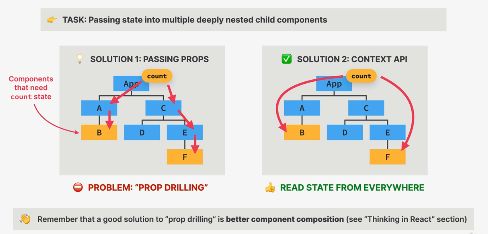
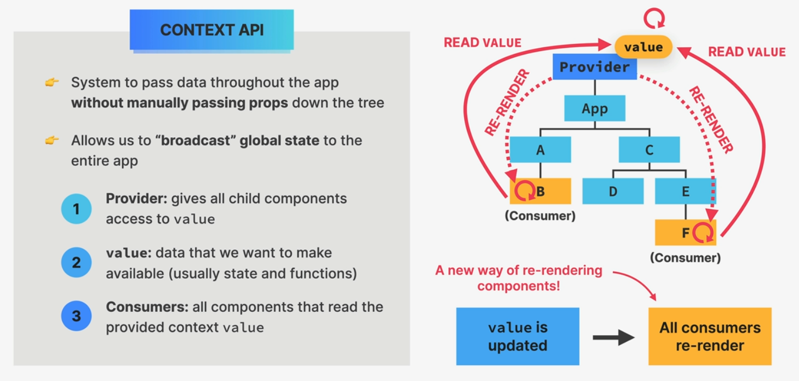
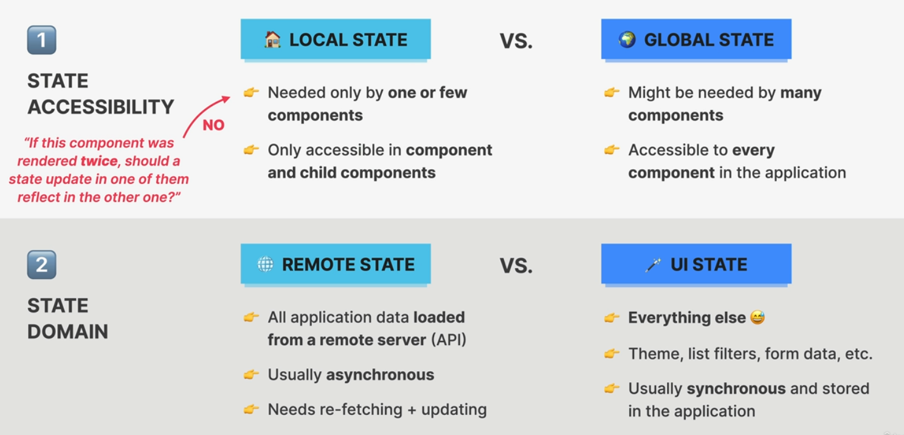
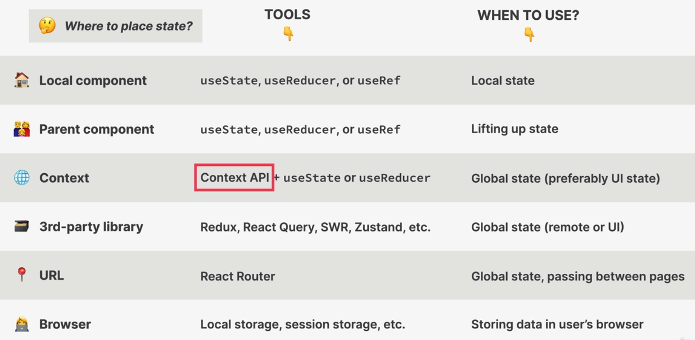
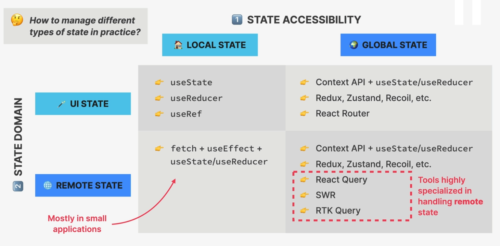

# Context API

## Context API in React





### What is Context API?

Context API is a React feature that enables sharing state across the component tree without prop drilling. It's perfect for managing global state like:

- Theme preferences
- User authentication
- Language settings
- Application-wide data

### Real Implementation Example

From our Atomic Blog project:

```jsx
// 1. Creating Context
const PostContext = createContext();

// 2. Provider Setup
<PostContext.Provider
  value={{
    posts,
    searchQuery,
    setSearchQuery,
    onAddPost,
    onClearPost,
  }}
>
  {/* Components */}
</PostContext.Provider>;

// 3. Consuming Context
function SearchPosts() {
  const { searchQuery, setSearchQuery } = useContext(PostContext);
  return (
    <input
      value={searchQuery}
      onChange={(e) => setSearchQuery(e.target.value)}
      placeholder="Search posts..."
    />
  );
}
```

### Context API Implementation Steps

1. **Create Context**

   ```jsx
   const MyContext = createContext();
   ```

2. **Provide Context**

   ```jsx
   <MyContext.Provider value={/* shared data */}>
     {/* Child components */}
   </MyContext.Provider>
   ```

3. **Consume Context**
   ```jsx
   const contextData = useContext(MyContext);
   ```

### Best Practices

1. **When to Use Context**

   - Global state management
   - Theme switching
   - User preferences
   - Authentication state
   - Shared data across multiple components

2. **When Not to Use Context**

   - For small component trees
   - When prop drilling is minimal
   - For performance-critical data
   - When state changes frequently

3. **Performance Considerations**
   - Context triggers re-renders for all consumers
   - Split contexts by functionality
   - Use `useMemo` for complex context values
   - Consider state management libraries for complex apps

### Common Patterns

1. **Multiple Contexts**

   ```jsx
   <ThemeContext.Provider>
     <UserContext.Provider>
       <DataContext.Provider>
         <App />
       </DataContext.Provider>
     </UserContext.Provider>
   </ThemeContext.Provider>
   ```

2. **Custom Context Hook**

   ```jsx
   function usePost() {
     const context = useContext(PostContext);
     if (context === undefined) {
       throw new Error("usePost must be used within a PostProvider");
     }
     return context;
   }
   ```

3. **Context with Reducer**
   ```jsx
   const [state, dispatch] = useReducer(reducer, initialState);
   <Context.Provider value={{ state, dispatch }}>
   ```

### Practical Example: PostProvider Component

Here's a complete example of how we implemented Context API in our blog using a separate PostProvider component:

```jsx
// PostProvider.js
const PostContext = createContext();

export function PostProvider({ children }) {
  const [posts, setPosts] = useState([]);
  const [searchQuery, setSearchQuery] = useState("");

  // Derived state
  const searchedPosts =
    searchQuery.length > 0
      ? posts.filter((post) =>
          `${post.title} ${post.body}`
            .toLowerCase()
            .includes(searchQuery.toLowerCase())
        )
      : posts;

  const value = {
    posts: searchedPosts,
    onAddPost: (post) => setPosts((posts) => [post, ...posts]),
    onClearPosts: () => setPosts([]),
    searchQuery,
    setSearchQuery,
  };

  return <PostContext.Provider value={value}>{children}</PostContext.Provider>;
}

// Custom hook for consuming the context
export function usePosts() {
  const context = useContext(PostContext);
  if (context === undefined)
    throw new Error("usePosts must be used within a PostProvider");
  return context;
}
```

Using the Provider:

```jsx
// App.js
function App() {
  return (
    <PostProvider>
      <Header />
      <Main />
      <Footer />
    </PostProvider>
  );
}
```

Consuming the context:

```jsx
// Any child component
function SearchPosts() {
  const { searchQuery, setSearchQuery } = usePosts();
  return (
    <input
      value={searchQuery}
      onChange={(e) => setSearchQuery(e.target.value)}
      placeholder="Search posts..."
    />
  );
}
```

Key benefits of this implementation:

1. **Separation of Concerns**: All post-related state management is isolated in PostProvider
2. **Custom Hook**: `usePosts` provides type-safe context consumption with error checking
3. **Derived State**: Search functionality is handled within the context
4. **Clean Component Tree**: No prop drilling needed for post-related data
5. **Reusability**: PostProvider can be used in any part of the application

This pattern demonstrates how to properly structure context in a React application while maintaining clean and maintainable code.

### Context vs Props

- **Props**: For component-specific data
- **Context**: For global or shared data
- **Rule of thumb**: If data needs to be accessed by many components at different nesting levels, use Context

### Tips for Effective Context Usage

1. Keep context values minimal
2. Split contexts by domain
3. Use context selectors
4. Implement error boundaries
5. Consider performance implications

# Types of state



## State placement



### State placement tools


